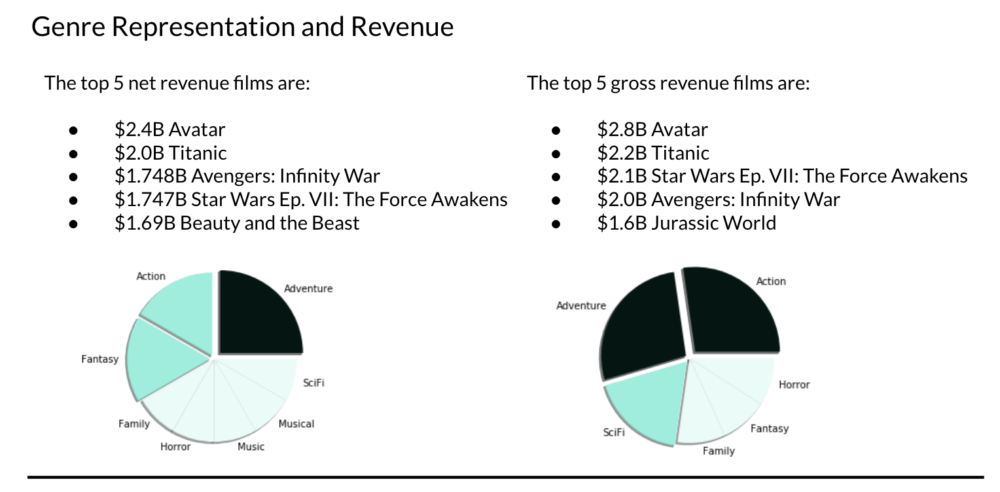
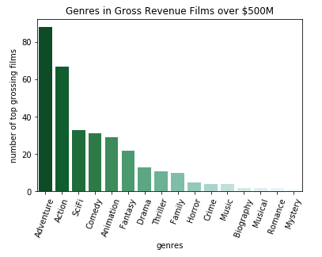
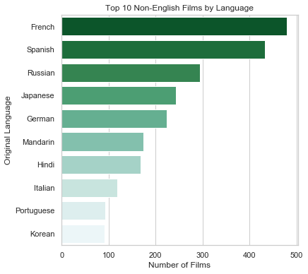

***Readme***

# Establishing a New Film Studio — Industry Insights and Recommendations

## Exploratory Data Analysis (EDA)

A discovery session was conducted to look at the provided datasets. Findings indicated that the data related well to each other and could be joined to understand these key items:

* Genres
* Net Profits
* Top ratings
* Director Involvement 
* Production Languages

These datasets were cleaned to allow pivoting on individual film genres and supplemented with API data from themoviedb.org. A SQLite3 database was created to leverage the datasets together to approach the goals and objectives of this project. <a href="https://github.com/kathanner/movie_industry_insights/blob/master/movies_db_schema.pdf">View database schema »</a>

## Goals and Objectives

### Find Genre Correlations with Industry Revenue

notebook: <a href="https://github.com/kathanner/movie_industry_insights/blob/master/f1_GenresNetProfit.ipynb">f1_GenresNetProfit.ipynb</a>

Correlating the IMDB genre data with our Budget dataset, we found the top films and associated genres as shown here. So, for top net revenue films, the most represented genre was Adventure followed closely by Action and Fantasy. And for the top gross revenue films, we found a similar genre representation with Action and Adventure followed by SciFi with the most representation.

Note: lower production cost != higher net revenue. And vice versa. Gross revenue can be considered as weighted heavier than production cost.

Looking at our Budget dataset, we can see that the highest Gross Revenue across IMDB genres are Adventure, Action, SciFi and Comedy. Specifically, we were interested in understanding the trend in film genres having a gross revenue of more than \\$500M. Here, we can see that of the 120 films grossing more than \\$500M, Adventure and Action are very popular genre associations. This also re-emphasizes the genre association in the top net-profit data.

### How do Ratings Impact Film Success?

notebook: <a href="https://github.com/kathanner/movie_industry_insights/blob/master/f2_topRatings.ipynb">f2_topRatings.ipynb</a>

From Rotten Tomatoes, films with the highest ratings and highest box office revenue are primarily distributed within these genres: 
* Drama
* Comedy 
* Adventure

In the chart here, these are the films that are A+, 100%, 5/5 top ratings (from both critics and users) and where box office revenue is above \\$100,000

Putting it all together, the genres for Action and Adventure are trending for a combination of net profits, highest ratings and box office revenue

But comparing ratings and box-office revenue, there may be potential in the top-rated genres of Drama and Comedy.

### Directors Influence on the Bottom Line

notebook: <a href="https://github.com/kathanner/movie_industry_insights/blob/master/f3_directorImpact.ipynb">f3_directorImpact.ipynb</a>

Of the top 5 net revenue films, nearly all of the directors are well known for their work on these films. 88% to be exact. By reviewing the IMDB data, we can see that 'Beauty and the Beast' is the outlier. The Director for this film, Bill Condon, is well known for other productions but just not for his work on this particular film.

Looking at the user/viewer ratings  in The Movie DB.org and considering viewer ratings of 7 or higher, we saw that 82% of the directors of these films are also well-known for their work on the top user-rated films.
We saw a direct correlation across data sets between directors, net revenue and top user-rated films from The Movie Database.org

### Language Markets

notebook: <a href="https://github.com/kathanner/movie_industry_insights/blob/master/f4_Languages.ipynb">f4_Languages.ipynb</a>

We looked at how language is represented in the film industry and we saw that English makes up 88% of films vs. 12% for non-English films. In that 12%, which includes 75 language, the top 10 occuring languages are clustered around ones spoken in Europe & Asia, in countries with a history of film-making: 
* France - the birthplace of cinema
* India & China - represented by multiple languages
And then looking at the non-English films we do have the figures for, the top 10 grossing films brought in about $762 million worldwide, with a net revenue of about $583 mil. Contrast that to the top 10 grossing English films at roughly $18 billion and it's a drop in the bucket. Our takeaway here confirms our assumptions, that the audience for films made in English is much larger than for non-English films, in U.S. as well as worldwide.

### Overall Recommendations

Consider the following strategic approaches:

***Genres with two options***
* Enter the market that produces the most net revenue: Action and Adventure.
* Invest in Sci-Fi and Comedy. These genres are not oversaturated and yield a healthy overall gross profit. 
 
***Directors***
* Pair well-known directors with top-grossing genres to optimize user ratings and net revenue.

***Languages***
* Primarily films made in English for a startup movie studio in the U.S. given the wider audience  and the size of the movie industry.

### Scalability and Future Objectives

Cross-platform integration based on character recognition

## Presentation of Recommendations
<a href="https://docs.google.com/presentation/d/1TLLzOPSfx9E24Lz7ISc95c0vQ1jmvrLaL5UBOHho_J4/edit?usp=sharing" target="_blank">Google Slides: Movie Industry Insights</a>

## Datasets and Sources

The provided datasets and supplemental API data came from the following sources:
* IMDB — Industry Data
* Box Office Mojo — Industry Data: An IMDB product 
* The Numbers — Industry Data: Movie Budget and Financial Performance Records
* Rotten Tomatoes — User-Generated and Industry Data: Critic and viewer reviews. Box office numbers.
* TheMovieDB.org — User-Generated Content: ratings

to create the database, run this notebook: <a href="https://github.com/kathanner/movie_industry_insights/blob/master/SQLiteDatabase.ipynb">SQLiteDatabase.ipynb</a>
